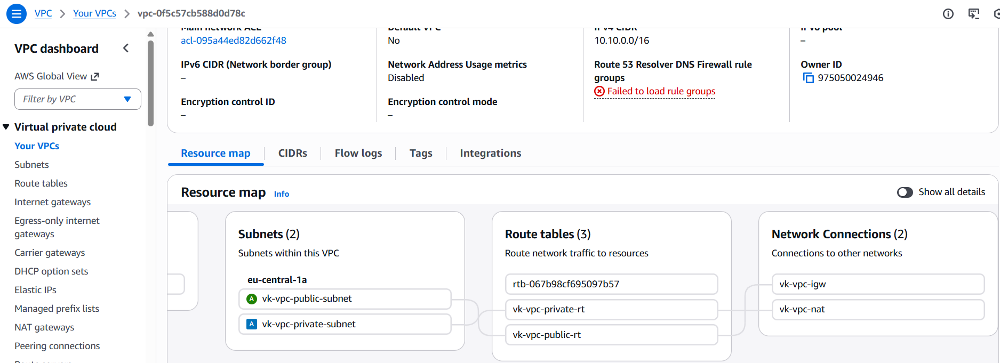
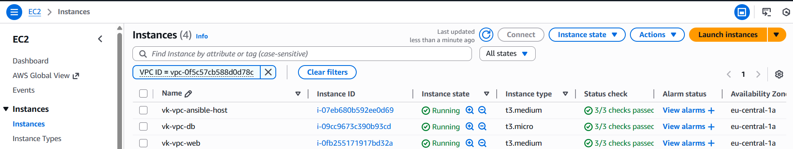
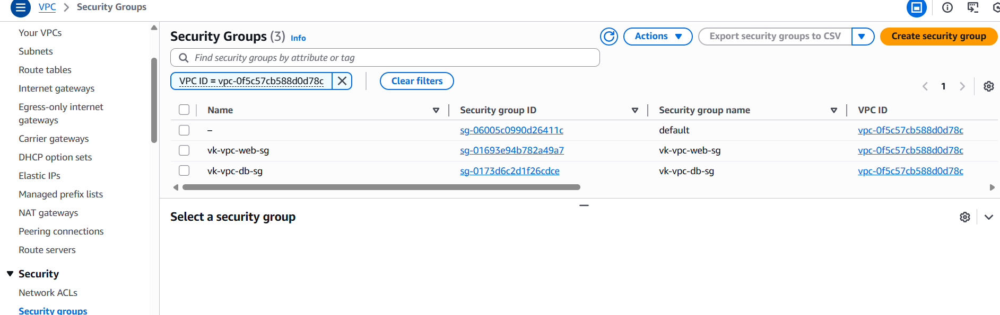
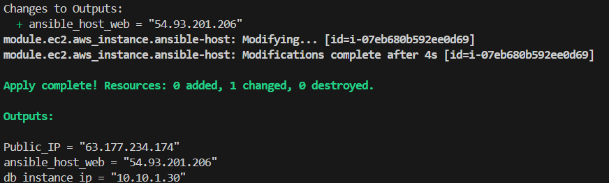
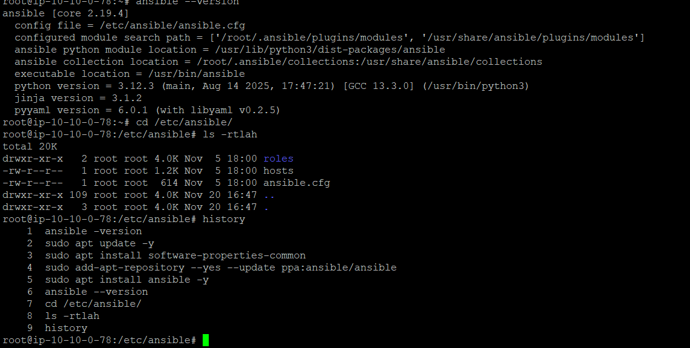
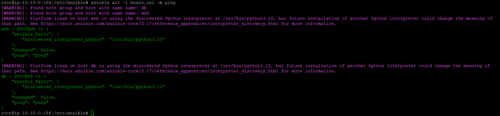

# terraform-demo
Part 1: Infrastructure Setup with Terraform

1. AWS Setup and Terraform Initialization:

   - Configure AWS CLI and authenticate with your AWS account. aws cli install on the laptop and aws configure has been set with Access key ID	Secret access key

   - Initialize a new Terraform project targeting AWS. 
   use command terraform init to initalize teh terraform

2. VPC and Network Configuration:

   - Create an AWS VPC with two subnets: one public and one private. 
   - Set up an Internet Gateway and a NAT Gateway. 
   - Configure route tables for both subnets. 

3. EC2 Instance Provisioning:

   - Launch two EC2 instances: one in the public subnet (for the web server) and another in the private subnet (for the database).
   

   - Ensure both instances are accessible via SSH (public instance only accessible from your IP). its configurable and open from user IP only while running the terraform apply command its taken care in the variable.

4. Security Groups and IAM Roles:

   - Create necessary security groups for web and database servers.

   - Set up IAM roles for EC2 instances with required permissions.

5. Resource Output:

   - Output the public IP of the web server EC2 instance and ansible
   

1. Ansible Configuration:

   Creating the EC2 by above terraform script as ansible master and with the help user data we are installing the ansible though apt, plese refer maint.tf under modules/ec2 for more details

Configure both DB and WEB server in the hosts.inin file and tranfer teh pem key to the master server through winscp.

Test the connectivity of both web and DB server from ansible master node 

2. Web Server Setup by installing the depedecy and applcation 

3. Database Server Setup:

  

   - Secure the MongoDB instance and create necessary users and databases.

4. Application Deployment:

   - Configure environment variables and start the Node.js application.

   - Ensure the React frontend communicates with the Express backend.

5. Security Hardening:

   - Harden the security by configuring firewalls and security groups.

   - Implement additional security measures as needed (e.g., SSH key pairs, disabling root login).

